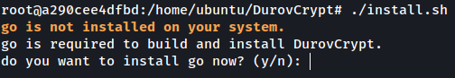

# DurovCrypt

  

DurovCrypt is GO language based file Encryptor and Decryptor. DurovCrypt uses AES 256+GCM encryption algorithm to encrypt and decrypt files.
Why use DurovCrypt? you ask, Imagine you store passwords, financial details, or private messages in a file on your computer. Now picture that file falling 
into the wrong hands a hacker, a nosy colleague, or even malware. scary, right? 

DurovCrypt protects your sensitive files like a digital vault by Encrypting it using a password. So even someone get the file 
they cant read it. 
 
            💳 Bank details in a File? Lock them with military grade encryption.
          
            🔑 Passwords stored Locally? Make them unreadable to anyone but you.

Unlike simple password protected ZIP files (which can be cracked), DurovCrypt uses AES-256 encryption the same standard governments use combined with
Argon2, a brute force resistant algorithm that makes hacking attempts nearly impossible.

🛡️ Real-World Protection
> 📌 "My laptop got stolen with all my tax documents!" → If they were encrypted, the thief gets useless gibberish.

>  
> 📌 "I save work API keys in a text file..." → A disgruntled coworker can’t leak what they can’t read.

No more accidental leaks, encrypted files hide secrets in plain sight.

With DurovCrypt, your files stay safe even if they’re stolen. Just remember your password because without it, not even supercomputers can break in.

Okay now move on with how to install DurovCrypt. 

# 🚀 Installation Guide
 DurovCrypt is designed to be easy to install on Linux, macOS. 

## Step 01 
You have to clone this repo--> https://github.com/Dulanga-Rukshan/DurovCrypt.git using git command, Here is the example 👇

  

## Step 02 
after that cd in to folder DurovCrypt 👇

  

## Step 03 
After that you have to run ./install.sh command to install all dependencies for DurovCrypt, DurovCrypt is go based language. So it need go compiler 
to run in a system ./install.sh will check the system if go installed in system it will build the DurovCrypt, unless go isn't installed in a system it will 
prompt you to install. 👇

  

  

## Step 04 
Now DurovCrypt is Ready to use you will get a prompt like this 👇

  

 
 

# 🔐 Usage Guide

## Start DurovCrypt

To start DurovCrypt just type DurovCrypt in a terminal. It will prompt you to DurovCrypt main interface, Like this 👇

  

 
 

## Let's Start Encrypting a file

I have a file name called file.txt in my home folder it contain simple plaintext msg. I cat in to it see what's in it. 👇

  

To encrypt this text file i type "DurovCrypt" in a terminal. Then i have to enter the file name for encryption
And a password for it. Here DurovCrypt expect a password. I have to type and retype the password, And most IMPORTANTLY i have to
remember that password, Because without it i can't decrypt the file that i encrypted. DurovCrypt expect in a good password.
what i mean by good password is password that has 👇

  

Without these characteristics DurovCrypt don't accept the password for encryption, And here is how you should enter a file name  👇

  

Now encrypted file is save in a my unencrypted file folder as file.txt.drv 👇

  

lets look at how encrypted file look like  👇

  

 
 

## Let's  Decrypt that file

To Decrypt the file that i encrypted, all i have to do is enter "DurovCrypt" in the terminal and select decrypt enter the file name 
i want to decrypt, and the password that used for encryption. It's look like this  👇

  

Now Decrypted file is saved in a encrpted file folder lets have a look in to it.  👇

  

  

## Help

If you stuck at using DurovCrypt. just type Help or select help option, it will prompt you help message how to use DurovCrypt. 

  

That's it. Currently DurovCrypt not available at windows. Let's dive into technical details how I created DurovCrypt.
DurovCrypt uses aes a symmetric key algorithm that means a same key uses for encrypt and decrypt the data. When you type your 
password for encryption, DurovCrypt don't use it directly. Instead, it feed it through Argon2 a special algorithm that's won
security competitions and add RNG or salt (random generated bytes) and nonce or initialization vecotor. Think of it like putting 
your password through a series of obstacle courses that deliberately take time and memory. This means, 

>  Simple passwords become harder to crack

>  Brute force attacks become impractical even with powerful computers

>  Every file gets unique protection, even if you use the same password

Your actual file gets encrypted using *AES-256 in GCM mode*, the same standard used to protect classified government documents. 
This isnt just scrambling, it creates,

> A virtually unbreakable encrypted version of your file

> Protection that stays strong even as computers get faster

Curently i didn't build hmac (hash based message authentication code) for DurovCrypt. A authentication of encrypted file when decrypting, because 
gcm is already taking card of it. Let's say hacker get your encrypted file now he wants decrypt and see data inside it, Lets see
how much time should he have to spend to crack the key. Meaning if a hacker don't know the password that used for encrypting a file he have 
to guess the password, by attacking it or so called brute forcing is the only way he can decrypt the file.
if you use password with, 

> Uppercase letters (A-Z)

> Lowercase letters (a-z)

> Numbers (0-9)

> Basic symbols (!, @, #, $, etc.)

The amount of time it going to take for hacker to brute force is shown below   👇

<h3>📊 Password Strength With Argon2 Protection</h3>
<table>
  <tr>
    <th>Password Type</th>
    <th>Example</th>
    <th>Time to Crack</th>
    <th>Security Level</th>
  </tr>
  <tr>
    <td><strong>Weak</strong></td>
    <td><code>A1b2@3</code></td>
    <td>~31 years</td>
    <td>❌ Risky</td>
  </tr>
  <tr>
    <td><strong>Strong</strong></td>
    <td><code>J#7kL$p9Xm2!</code></td>
    <td>~100 million years</td>
    <td>✅ Robust</td>
  </tr>
  <tr>
    <td><strong>Passphrase</strong></td>
    <td><code>Purple$Bike!Rust42</code></td>
    <td>Age of the universe</td>
    <td>🛡️ Future proof</td>
  </tr>
</table>

As you can see the more longer and complex password, longer it takes to brute force and take the password. So that's why DurovCrypt encorges to 
use strong password. This takes us to another question. If i forget the password can i decrypt the file? nope you can't. Thats it. Don't forget, files isn't
encrypting through your password. it only takes it for a key generation, the key is the one that going to encrypt your file. The key is 256 bit long 
when each time you encrypt file you enter password and there is a salt and nonce (a random data) stored in a encrypted file. When you
encrypt the file it generats those vlaues(salt and nonce) and write to the file. when you try to decrypt using DurovCrypt it takes that salt and nonce and your password generate a key. That key is equal to the one you encrypt the file with. if not equal the passsword is wrong. Password is like a validation here. That key is 256 bit long
that's why it's called aes256 bit encryption. That means there can be are 2²⁵⁶ value of keys can be exist. One of that is your key. 

> 2²⁵⁶ ----> 115,792,089,237,316,195,423,570,985,008,687,907,853,269,984,665,640,564,039,457,584,007,913,129,639,936 keys

The best case scenario for the hacker to guess that key is if he uses world’s fastest supercomputer it can test 1 quintillion (10¹⁸) keys per second it 
would take about, 

> Keys tested per second	------>   2²⁵⁶ / 10¹⁸ ≈ 3.4 × 10⁶⁹ seconds

> Convert to years	≈ 1.07 × 10⁶² years

the age of the universe is 13.8 billion years mean 10¹⁰ years, to crack the AES 256 would take ~10⁵² × the age of the universe to brute force. 
You can argue what about quantum computers, can't they break it in future or some Five eyes country use their computer arsenal to decrypt the key
(unless you are a most wanted man in the world), Let's take most fastest existing quantum attack algorithm the grovers algorithm it reduces the 256 to 128 
so time required for it is 2¹²⁸ operations still ~10²⁸ years it is impossible in practice. Aes is one of the most widely used encryption algorithms 
in the world. If a crypto algorithm is private wouldn't it be more secure? no. it's the quite opposite. The more the use of a crypto algorithms more
cryptanalysts in community try to break it, more about it you can read it here -->https://www.networkcomputing.com/network-security/just-say-no-to-proprietary-cryptographic-algorithms

> "Anyone can design a crypto system they themselves can't break. The real test is whether anyone else can break it." - Bruce Schneier

You are free to test and find bugs and submit report, send additional feature suggestions, basically anything for this application, 

Hey btw send me a feedback, I love to hear your experience even its a shitty one :) -->Dulangarukshan@proton.me  
